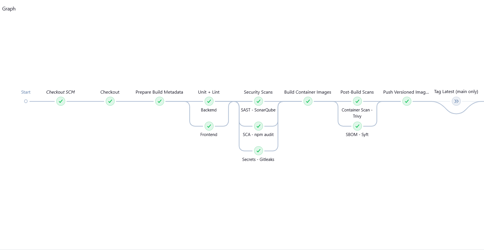
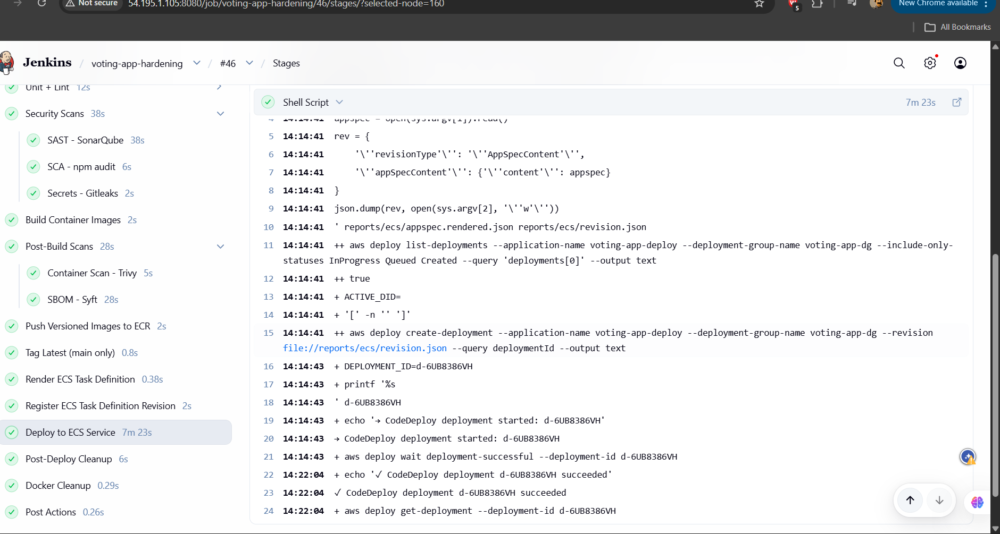

# Secure Jenkins CI/CD Pipeline — Node.js Voting App on AWS ECS Fargate

A hardened CI/CD platform that builds, scans, and deploys a Node.js voting application to **AWS ECS Fargate** using **CodeDeploy blue/green deployments**. The pipeline enforces security gates (SAST, SCA, secrets scanning, container vulnerability scanning) and only promotes code that passes all checks.

---

## Table of Contents

- [What the Application Does](#what-the-application-does)
- [Architecture](#architecture)
- [CI/CD Pipeline](#cicd-pipeline)
- [Security Gates](#security-gates)
- [CodeDeploy Blue/Green Deployments](#codedeploy-bluegreen-deployments)
- [Infrastructure as Code](#infrastructure-as-code)
- [Repository Layout](#repository-layout)
- [Prerequisites](#prerequisites)
- [Getting Started](#getting-started)
- [Pipeline Parameters](#pipeline-parameters)
- [Backend API Reference](#backend-api-reference)
- [Local Development](#local-development)
- [Screenshots](#screenshots)
- [Security Notes](#security-notes)

---

## What the Application Does

The app is a **real-time team voting poll**. Users pick which team should host the next company townhall from three choices: Engineering, Product, or Design. Each vote is stored in Redis and exposed via a REST API. The frontend is a single-page HTML app served by Nginx that reverse-proxies API requests to the backend.

---

## Architecture

```
  Developer
     │  git push
     ▼
  GitHub ──webhook──▶ Jenkins (EC2 · t3.medium · port 8080)
                         │
        ┌────────────────┼────────────────────────┐
        ▼                ▼                        ▼
   Unit + Lint    Security Scans          Build Images
                  (SonarQube, npm         (Docker)
                   audit, Gitleaks)            │
                         │                     ▼
                         ▼              Post-Build Scans
                   Quality Gate         (Trivy, SBOM/Syft)
                         │                     │
                         └──────────┬──────────┘
                                    ▼
                              Push to ECR
                     (049618907165.dkr.ecr.eu-west-1)
                                    │
                                    ▼
                        Register ECS Task Definition
                                    │
                                    ▼
                     CodeDeploy Blue/Green Deployment
                                    │
                    ┌───────────────┼───────────────┐
                    ▼                               ▼
             Blue Task Set                   Green Task Set
            (current prod)                  (new version)
                    │                               │
                    └───────────┬───────────────────┘
                                ▼
                    ALB (voting-app-alb:80)
                         │
              ┌──────────┼──────────┐
              ▼          ▼          ▼
          Frontend    Backend     Redis
          (Nginx:80) (Node:3000) (:6379)
          ── all in one ECS Fargate task ──
```

### Infrastructure Components

| Component | Service | Details |
|-----------|---------|---------|
| **Jenkins** | EC2 `t3.medium` | Build server with IAM role for ECR/ECS/CodeDeploy |
| **ECS Cluster** | Fargate | `voting-cluster` — serverless container hosting |
| **ECS Service** | Fargate | `voting-app` — 1 task, 3 containers (frontend, backend, redis) |
| **ALB** | Application LB | Routes traffic on port 80, health check on `/nginx-health` |
| **ECR** | Container Registry | `backend-service` and `frontend-web` repositories |
| **CodeDeploy** | Blue/Green | `voting-app-deploy` app, `voting-app-dg` deployment group |
| **CloudWatch** | Logs | `/ecs/voting-app/backend` and `/ecs/voting-app/frontend` log groups |
| **SonarQube** | SAST | Static analysis on Jenkins EC2 (port 9000) |

---

## CI/CD Pipeline

The Jenkins pipeline runs automatically on every push to `main` via GitHub webhook. It has **13 stages**:

```
Checkout SCM
  └─▶ Checkout
        └─▶ Prepare Build Metadata
              └─▶ Unit + Lint (parallel: Backend, Frontend)
                    └─▶ Security Scans (parallel: SonarQube, npm audit, Gitleaks)
                          └─▶ Build Container Images
                                └─▶ Post-Build Scans (parallel: Trivy, SBOM/Syft)
                                      └─▶ Push Versioned Images to ECR
                                            └─▶ Tag Latest (main only)
                                                  └─▶ Render ECS Task Definition
                                                        └─▶ Register ECS Task Definition Revision
                                                              └─▶ Deploy to ECS Service (CodeDeploy)
                                                                    └─▶ Post-Deploy Cleanup
                                                                          └─▶ Docker Cleanup
```

**Key behaviours:**
- Docker images tagged as `<branch>-<git-sha>-<build-number>` (e.g., `main-bb9fc74a-46`)
- AWS account ID auto-detected from EC2 IAM role — no static AWS credentials in Jenkins
- Deployment only happens on `main` branch (unless `DEPLOY_FROM_NON_MAIN` is enabled)
- Old ECR images pruned via lifecycle policy (keeps last 30)
- Old ECS task definition revisions deregistered (keeps last 15)
- Active CodeDeploy deployments auto-stopped before creating new ones

---

## Security Gates

The pipeline enforces multiple security checks. A failure in any gate **blocks the build**:

| Gate | Tool | What It Checks | Blocks On |
|------|------|----------------|-----------|
| **SAST** | SonarQube | Code quality, bugs, code smells, security hotspots | Quality gate failure |
| **SCA** | npm audit | Known vulnerabilities in dependencies | CRITICAL or HIGH severity |
| **Secrets** | Gitleaks | Hardcoded secrets, API keys, tokens in git history | Any finding |
| **Container Scan** | Trivy | OS and library CVEs in built Docker images | CRITICAL severity |
| **SBOM** | Syft | Software Bill of Materials generation | Informational (no block) |

<!-- Screenshot: Security Scans stage -->

---

## CodeDeploy Blue/Green Deployments

The pipeline uses AWS CodeDeploy to perform **zero-downtime blue/green deployments** to ECS Fargate:

1. **New task set** (green) starts with the updated container images
2. **ALB health check** validates the green task set on `/nginx-health`
3. **Traffic shifts** from blue to green once health checks pass
4. **Old task set** (blue) drains connections and terminates after a configurable wait period

**Deployment timeline** (~3 min with current settings):

| Phase | Duration |
|-------|----------|
| Spin up replacement task set | ~1–7 min |
| ALB health checks pass (30s × 2 threshold) | ~1 min |
| Traffic reroute to green | ~30s |
| Termination wait for blue task set | 1 min |
| Drain & stop old task | ~30s |

The termination wait is configurable in `infra/terraform/terraform.tfvars` via `codedeploy_termination_wait`.

<!-- Screenshot: Deploy to ECS Service stage -->

---

## Infrastructure as Code

All AWS infrastructure is managed with **Terraform** in `infra/terraform/`:

| Module | Resources Created |
|--------|------------------|
| `modules/ecr/` | ECR repositories with lifecycle policies |
| `modules/ecs_fargate/` | ECS cluster, service, task definition, ALB, target groups, security groups, CodeDeploy app + deployment group |
| `modules/jenkins_ec2/` | EC2 instance, IAM role + policies, security group, key pair |
| `modules/cloudwatch_alarms/` | CloudWatch alarms for ECS monitoring |

### Key Terraform Variables

| Variable | Default | Description |
|----------|---------|-------------|
| `aws_region` | `eu-west-1` | AWS region |
| `project_name` | `voting-app` | Prefix for all resources |
| `enable_codedeploy` | `true` | Enable CodeDeploy blue/green (vs. rolling ECS) |
| `codedeploy_termination_wait` | `1` | Minutes to wait before terminating old task set |
| `jenkins_instance_type` | `t3.medium` | Jenkins EC2 instance type |

---

## Repository Layout

```
.
├── Jenkinsfile                    Pipeline definition (13 stages)
├── Makefile                       Common development shortcuts
├── docker-compose.app.yml         Local development stack
├── sonar-project.properties       SonarQube configuration
│
├── backend/                       Node.js/Express API
│   ├── src/
│   │   ├── app.js                 Routes, middleware, Prometheus metrics
│   │   ├── server.js              HTTP server entry point
│   │   └── redis.js               Redis client with graceful fallback
│   ├── tests/app.test.js          Jest test suite
│   ├── Dockerfile                 Multi-stage production build
│   └── package.json
│
├── frontend/                      Static HTML/CSS/JS voting UI
│   ├── src/
│   │   ├── index.html             Single-page voting interface
│   │   ├── app.js                 Frontend logic
│   │   └── styles.css             Styling
│   ├── nginx.conf                 Nginx reverse proxy config (localhost:3000)
│   ├── tests/app.test.js          Frontend tests
│   ├── Dockerfile                 Multi-stage build (Node → nginx:1.27-alpine)
│   └── package.json
│
├── ecs/                           ECS deployment templates
│   ├── taskdef.template.json      Task definition with placeholder tokens
│   ├── taskdef.revision.json      Last registered task definition
│   └── appspec.template.json      CodeDeploy AppSpec for blue/green
│
├── infra/terraform/               Infrastructure as Code
│   ├── main.tf                    Root module composition
│   ├── variables.tf               Input variables
│   ├── outputs.tf                 Exported values
│   ├── terraform.tfvars           Environment-specific values
│   ├── versions.tf                Provider versions
│   └── modules/
│       ├── ecr/                   ECR repositories
│       ├── ecs_fargate/           ECS + ALB + CodeDeploy
│       ├── jenkins_ec2/           Jenkins EC2 + IAM
│       └── cloudwatch_alarms/     Monitoring alarms
│
├── jenkins/
│   └── plugins.txt                Required Jenkins plugins
│
├── scripts/                       Operational scripts
│   ├── install-jenkins.sh         Jenkins installation script
│   ├── install_ci_security_stack.sh  Install security tools (Trivy, Syft, Gitleaks)
│   ├── setup-aws-secrets.sh       AWS secrets configuration
│   └── verify_jenkins_env_vars.sh Jenkins environment verification
│
└── reports/                       Build artifacts (gitignored)
    ├── ecs/                       Task def, appspec, deployment results
    ├── sbom/                      SBOM output (Syft)
    └── security/                  Security scan reports
```

---

## Prerequisites

- **AWS account** with permissions to create EC2, ECR, ECS, ALB, CodeDeploy, IAM
- **Terraform** >= 1.5
- **AWS CLI** configured locally (for initial `terraform apply`)
- **Git** with access to this repository

---

## Getting Started

### Step 1 — Provision Infrastructure

```bash
cd infra/terraform
cp terraform.tfvars.example terraform.tfvars
# Edit terraform.tfvars with your settings
terraform init
terraform apply
```

This creates: ECS Fargate cluster + service, ALB with two target groups, ECR repos, Jenkins EC2 with IAM role, CodeDeploy application + deployment group, CloudWatch log groups.

### Step 2 — Configure Jenkins

1. Navigate to `http://<jenkins-ec2-ip>:8080`
2. Get initial password: `ssh ec2-user@<ip> "cat /var/lib/jenkins/secrets/initialAdminPassword"`
3. Install suggested plugins + plugins from `jenkins/plugins.txt`
4. Set **Global Properties** (Manage Jenkins → System → Environment variables):

   | Variable | Value | Description |
   |----------|-------|-------------|
   | `AWS_DEFAULT_REGION` | `eu-west-1` | AWS region |
   | `BACKEND_ECR_REPO` | `backend-service` | Backend ECR repo name |
   | `FRONTEND_ECR_REPO` | `frontend-web` | Frontend ECR repo name |
   | `ECS_CLUSTER_NAME` | `voting-cluster` | ECS cluster name |
   | `ECS_SERVICE_NAME` | `voting-app` | ECS service name |
   | `ECS_TASK_FAMILY` | `voting-app` | Task definition family |
   | `ECS_TASK_CPU` | `1024` | Task CPU units (1 vCPU) |
   | `ECS_TASK_MEMORY` | `2048` | Task memory in MB |

5. Create a **Pipeline** job pointing to this GitHub repo
6. Add a GitHub webhook: `http://<jenkins-ip>:8080/github-webhook/`

### Step 3 — Install Security Tools on Jenkins

```bash
ssh -i <key> ec2-user@<jenkins-ip>
sudo bash /path/to/scripts/install_ci_security_stack.sh
```

This installs Trivy, Syft, and Gitleaks on the Jenkins host.

### Step 4 — Push and Deploy

Push a commit to `main`. The pipeline will:
1. Run all tests and security scans
2. Build and push Docker images to ECR
3. Register a new ECS task definition
4. Trigger a CodeDeploy blue/green deployment
5. Wait for the deployment to succeed
6. Clean up old images and task definitions

### Step 5 — Access the Application

| Service | URL |
|---------|-----|
| **Voting App** | `http://<alb-dns-name>` |
| **Health Check** | `http://<alb-dns-name>/nginx-health` |
| **API Health** | `http://<alb-dns-name>/api/health` |
| **Jenkins** | `http://<jenkins-ip>:8080` |
| **SonarQube** | `http://<jenkins-ip>:9000` |

---

## Pipeline Parameters

| Parameter | Default | Description |
|-----------|---------|-------------|
| `ENABLE_SONARQUBE` | `true` | Run SonarQube static analysis |
| `ENABLE_NPM_AUDIT` | `true` | Run npm audit dependency scan |
| `ENABLE_GITLEAKS` | `true` | Run Gitleaks secret scanning |
| `ENABLE_TRIVY` | `true` | Run Trivy container vulnerability scan |
| `ENABLE_SBOM` | `true` | Generate SBOM with Syft |
| `DEPLOY_FROM_NON_MAIN` | `false` | Allow deployment from non-main branches |

---

## Backend API Reference

| Method | Endpoint | Description |
|--------|----------|-------------|
| GET | `/api/health` | Health check — returns `{ status: "ok" }` |
| GET | `/api/poll` | Returns poll question and options |
| POST | `/api/vote` | Cast a vote — body: `{ "option": "Engineering" }` |
| GET | `/api/results` | Returns current vote totals |
| GET | `/metrics` | Prometheus metrics endpoint |

---

## Local Development

Run the full stack locally (no AWS needed):

```bash
docker compose -f docker-compose.app.yml up
# App at http://localhost:80
# API at http://localhost:3000
```

Run tests:

```bash
cd backend && npm install && npm test
cd frontend && npm install && npm test
```

---

## Screenshots

> Add your screenshots below to document the pipeline and deployment process.

### Jenkins Pipeline Overview


### Successful Build Logs



---

## Security Notes

| # | Topic | Detail |
|---|-------|--------|
| 1 | **IAM least-privilege** | Jenkins EC2 role is scoped to only ECR push, ECS task-def registration, CodeDeploy operations, and CloudWatch logs |
| 2 | **No static AWS credentials** | Pipeline uses EC2 instance IAM role — no access keys stored in Jenkins |
| 3 | **Container scanning** | Trivy blocks builds on CRITICAL CVEs; images are patched with latest Alpine security updates |
| 4 | **Secret detection** | Gitleaks scans the full git history for leaked credentials |
| 5 | **Dependency auditing** | npm audit checks for known vulnerabilities in both backend and frontend |
| 6 | **Blue/green zero-downtime** | CodeDeploy ensures no dropped requests during deployment |
| 7 | **No HTTPS (demo)** | All traffic is HTTP — production should add TLS via ACM certificate on the ALB |
| 8 | **Redis has no auth (demo)** | Redis runs as a sidecar with no password — production should use ElastiCache with auth |
| 9 | **Public ALB (demo)** | ALB accepts traffic from `0.0.0.0/0` — production should restrict or add WAF |
